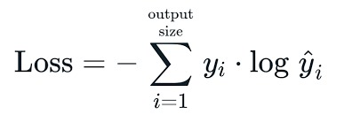

# Criando uma rede neural básica
Os treinos realizados nesta pasta foram feitos com base no canal <br />

* [SentDex](https://www.youtube.com/@sentdex). <br />


Pequenas modificações foram feitas apenas para estudo e testes, a autoria permanece ao criador de conteúdo e livro usado como base nos vídeos.<br><br>


## Algumas formulas utilizadas :
### *SOFTMAX*<BR>

 <br />

* também chamada de saída, vai transformar vetores scores em um vetor de probabilidade, ajuda evitar overflow <br>
 **Usada no trecho** :
 
```python
class Activation_Softmax:
    def foward(self,entradas):
        valor_exp = np.exp(entradas - np.max(entradas, axis=1, keepdims=True))
        probabildades = valor_exp/np.sum
        self.saida = probabildades
```

# LOSS (categorical cross entropy)



 **Usada no trecho** :
 
```python
class Loss:
    def calcula(self,output,y0):
        sample_loss = self.foward(output,y)
        data_loss = np.mean(sample_loss)
        return data_loss
    
class Entropia_cruzada(Loss):
    def foward(self,y_pred,y_true):
        amostras = len(y_pred)
        y_pred_reduz = np.clip(y_pred,1e-7,1e-7)#reponsável para não dar valoreos infinitos, pq caso de 0 pode ocorrer um erro de valor infinito 
        if len(y_true.shape)==1:
            correcao_de_confidencias = y_pred_reduz[range(amostras),y_true] # aqui é a seleção de itens das amostras,o  range (amostras) vai primeiro pegar todas as amostras disponíveis, e o ,y_true serve apra filtra quais querem pegar, pegando um valor por linhas
        elif len(y_true.shape) == 2 :
            correcao_de_confidencias = np.sum(y_pred_reduz * y_true, axis = 10)

        log_Negativo = -np.log(correcao_de_confidencias)
        return log_Negativo

```

